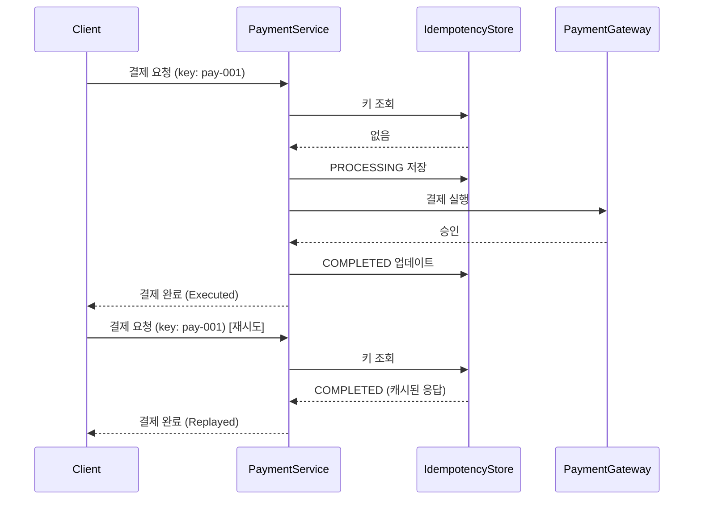
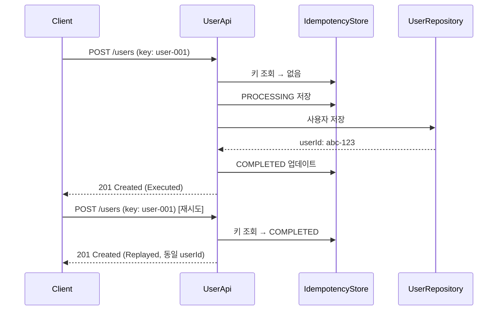
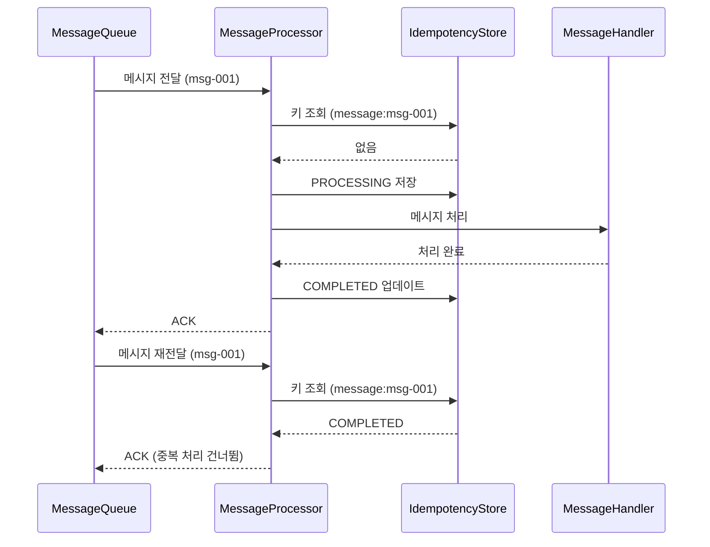

# 멱등성 키 패턴

동일한 요청이 여러 번 실행되더라도 결과가 한 번만 적용되도록 보장하는 멱등성 키(Idempotency Key) 패턴의 구현입니다.

클라이언트가 고유한 키를 함께 전송하면, 서버는 동일한 요청의 중복 처리를 방지하고 이전 결과를 재사용합니다.

## 케이스

| # | 케이스 | 도메인 | 핵심 포인트 | 키 전략 |
|---|--------|--------|-------------|---------|
| 1 | 결제 처리 | 온라인 결제 | 중복 과금 방지 | 클라이언트 제공 |
| 2 | API 요청 | 사용자 생성 | 중복 리소스 생성 방지 | 클라이언트 제공 |
| 3 | 메시지 처리 | 메시지 큐 | 중복 메시지 처리 방지 | 메시지 ID에서 자동 파생 |

---

## Case 1: 결제 처리

클라이언트가 멱등성 키를 포함하여 결제를 요청합니다. 동일한 키로 재요청 시 실제 결제 없이 캐시된 결과를 반환합니다.



결제 게이트웨이는 실제로 1번만 호출되며, `processedCount`로 검증할 수 있습니다.

---

## Case 2: API 요청 (사용자 생성)

POST 요청의 멱등성을 보장합니다. 네트워크 오류로 클라이언트가 응답을 받지 못해 재요청하더라도 사용자가 중복 생성되지 않습니다.



중복 요청 시 동일한 `userId`가 반환되므로, 클라이언트는 안전하게 재시도할 수 있습니다.

---

## Case 3: 메시지 처리

메시지 큐에서 동일 메시지가 재전송(at-least-once delivery)될 때 중복 처리를 방지합니다. 메시지 ID를 멱등성 키로 활용합니다.



Case 1, 2와 달리 클라이언트가 키를 제공하지 않고, 메시지 ID에서 `IdempotencyKey.from("message", messageId)`로 자동 파생합니다.

---

## 핵심 개념

### 멱등성 키 상태 전이

```
[요청 수신] → PROCESSING → [작업 성공] → COMPLETED
                         → [작업 실패] → FAILED → [재시도 가능]
```

- **PROCESSING**: 작업이 실행 중. 동일 키로 들어오는 요청은 `Rejected`로 거부
- **COMPLETED**: 작업 완료. 동일 키로 들어오는 요청은 캐시된 응답을 `Replayed`로 반환
- **FAILED**: 작업 실패. 동일 키로 들어오는 요청은 새로운 실행으로 재시도 가능

### 결과 타입 (IdempotencyResult)

| 타입 | 의미 | 작업 실행 여부 |
|------|------|----------------|
| `Executed<T>` | 새로운 요청이 실행됨 | O |
| `Replayed<T>` | 캐시된 응답이 반환됨 | X |
| `Rejected` | 요청이 거부됨 (처리 중 충돌) | X |

`Executed`와 `Replayed`를 구분하므로, 호출자가 실제 실행 여부를 파악할 수 있습니다.

### 동시 요청 처리

동일한 키로 동시에 요청이 도착하면, `ConcurrentHashMap.putIfAbsent`를 통해 첫 번째 요청만 `PROCESSING` 상태를 획득하고 나머지는 `Rejected`로 거부됩니다.

### 키 만료 (TTL)

멱등성 레코드는 설정된 TTL 이후 자동으로 만료됩니다. 만료된 키로 요청하면 새로운 요청으로 처리됩니다.

---

## 핵심 구조

```
core/
├── IdempotencyKey              멱등성 키 값 객체 (generate, from 팩토리)
├── IdempotencyResult           실행/재생/거부 결과 sealed class
├── IdempotencyRecord           키별 상태 레코드 (PROCESSING/COMPLETED/FAILED)
├── IdempotencyStore            저장소 인터페이스
├── InMemoryIdempotencyStore    ConcurrentHashMap 기반 인메모리 구현
└── IdempotencyExecutor         멱등성 보장 실행기 (핵심 오케스트레이터)

payment/                        결제 중복 방지 시나리오
api/                            API 리소스 중복 생성 방지 시나리오
message/                        메시지 중복 처리 방지 시나리오
```

## 실행 방법

```bash
./gradlew test
```
