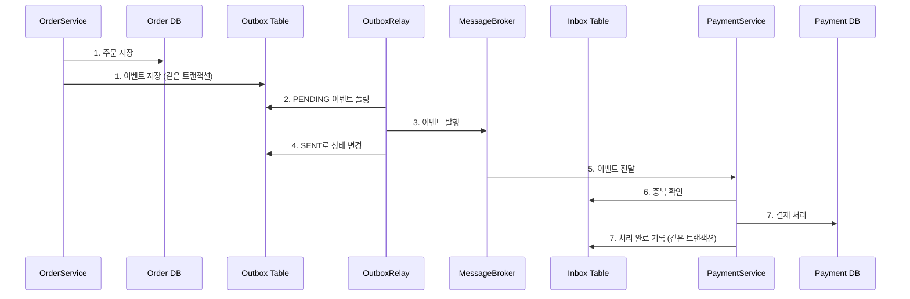
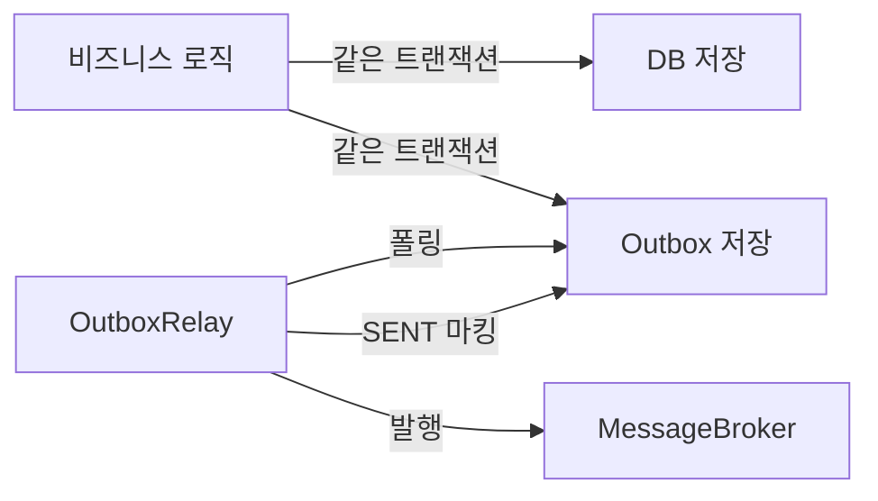
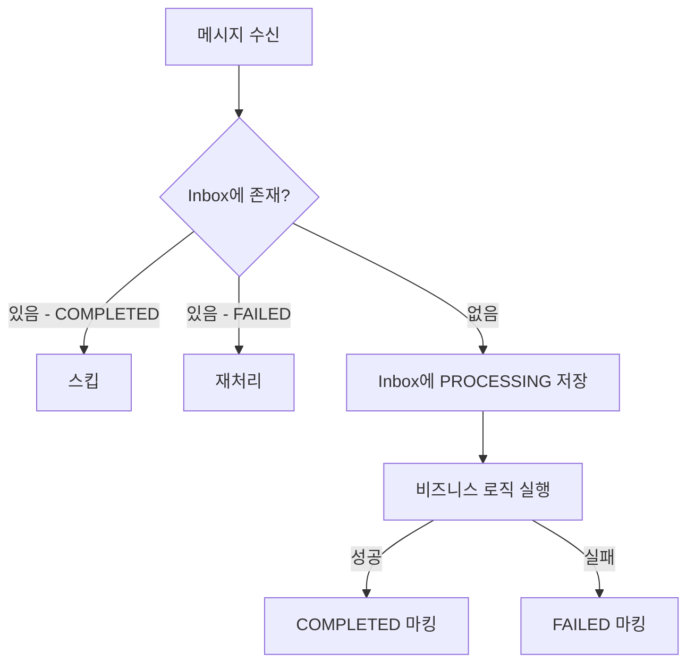

# Outbox + Inbox 패턴

마이크로서비스 간 신뢰성 있는 이벤트 전달을 보장하는 Outbox 패턴과 Inbox 패턴의 학습용 프로젝트입니다.

Outbox 패턴은 비즈니스 데이터와 이벤트를 동일 트랜잭션에 저장하여 **최소 한 번(at-least-once)** 이벤트 전달을 보장하고,
Inbox 패턴은 수신 측에서 메시지 중복을 제거하여 **정확히 한 번(exactly-once)** 처리를 보장합니다.

## 문제 상황

분산 시스템에서 DB 저장과 메시지 발행이 별도의 작업일 때:

| 상황 | 결과 |
|------|------|
| DB 저장 성공 + 메시지 발행 실패 | 이벤트 유실 |
| DB 저장 실패 + 메시지 발행 성공 | 존재하지 않는 데이터에 대한 이벤트 |
| 메시지 중복 전달 | 중복 처리 (결제 2회 등) |

## 해결: Outbox + Inbox

| 패턴 | 역할 | 보장 |
|------|------|------|
| **Outbox** | 이벤트를 DB에 저장 후 별도 프로세스가 발행 | At-least-once delivery |
| **Inbox** | 수신 메시지 ID로 중복 확인 후 처리 | Exactly-once processing |

---

## 전체 흐름: 주문 → 결제



---

## Outbox 패턴

비즈니스 데이터와 이벤트를 동일 트랜잭션에 저장합니다. 별도 Relay 프로세스가 주기적으로 Outbox를 폴링하여 이벤트를 발행합니다.



### 핵심 코드

```kotlin
// TransactionalOutbox: 비즈니스 로직 + 이벤트를 원자적으로 저장
transactionalOutbox.executeWithOutbox(outboxRecord) {
    orderStore.save(order)
    order
}

// OutboxRelay: PENDING 이벤트를 폴링하여 발행
relay.pollAndPublish()
// → PENDING 조회 → 브로커에 발행 → SENT 마킹
```

### Outbox 상태 전이

```
PENDING → [Relay 발행 성공] → SENT
PENDING → [Relay 발행 실패] → FAILED (retryCount 증가)
```

---

## Inbox 패턴

수신한 메시지 ID를 Inbox 테이블에서 확인하여 중복 처리를 방지합니다.



### 핵심 코드

```kotlin
// InboxProcessor: 중복 확인 후 처리
inboxProcessor.process(message) { msg ->
    val event = OrderCreatedEvent.fromPayload(msg.payload)
    paymentStore.save(Payment(...))
}
// → Inbox에 존재? COMPLETED면 스킵, FAILED면 재처리, 신규면 처리
```

### Inbox 상태 전이

```
[신규 메시지] → PROCESSING → [처리 성공] → COMPLETED
                            [처리 실패] → FAILED → [재시도 가능]
```

---

## 핵심 구조

```
core/
├── OutboxRecord              아웃박스 레코드 (PENDING/SENT/FAILED)
├── OutboxStore               저장소 인터페이스
├── InMemoryOutboxStore       ConcurrentHashMap 기반 구현
├── TransactionalOutbox       비즈니스 로직 + 아웃박스 원자적 실행
├── OutboxRelay               폴링 → 메시지 브로커 발행
├── InboxRecord               인박스 레코드 (PROCESSING/COMPLETED/FAILED)
├── InboxStore                저장소 인터페이스
├── InMemoryInboxStore        ConcurrentHashMap 기반 구현
├── InboxProcessor            메시지 중복 제거 + 처리
├── Message                   메시지 전송 단위
├── MessageBroker             Pub/Sub 인터페이스
└── InMemoryMessageBroker     인메모리 Pub/Sub 구현

scenario/order/
├── Order, OrderStore         주문 도메인 (생산자)
├── OrderCreatedEvent         주문 생성 이벤트
├── OrderService              Outbox를 사용하는 주문 서비스
├── Payment, PaymentStore     결제 도메인 (소비자)
└── PaymentService            Inbox를 사용하는 결제 서비스
```

## 실행 방법

```bash
./gradlew test
```
