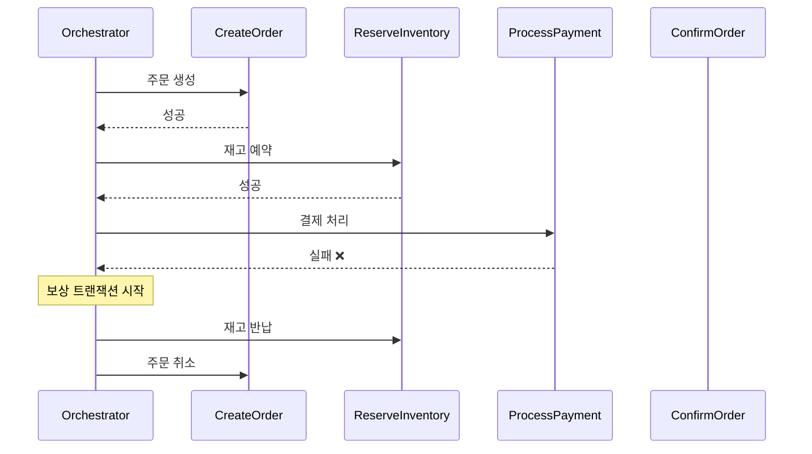
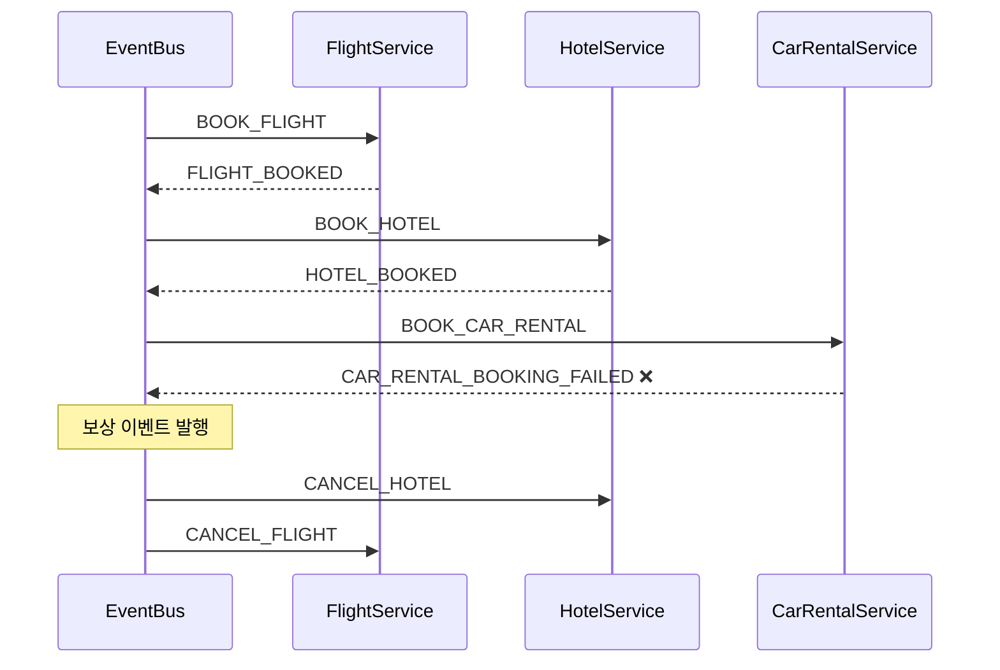
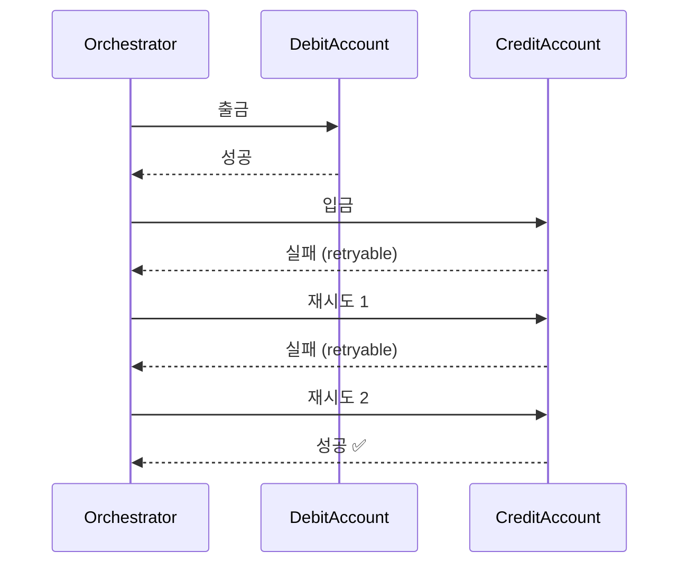
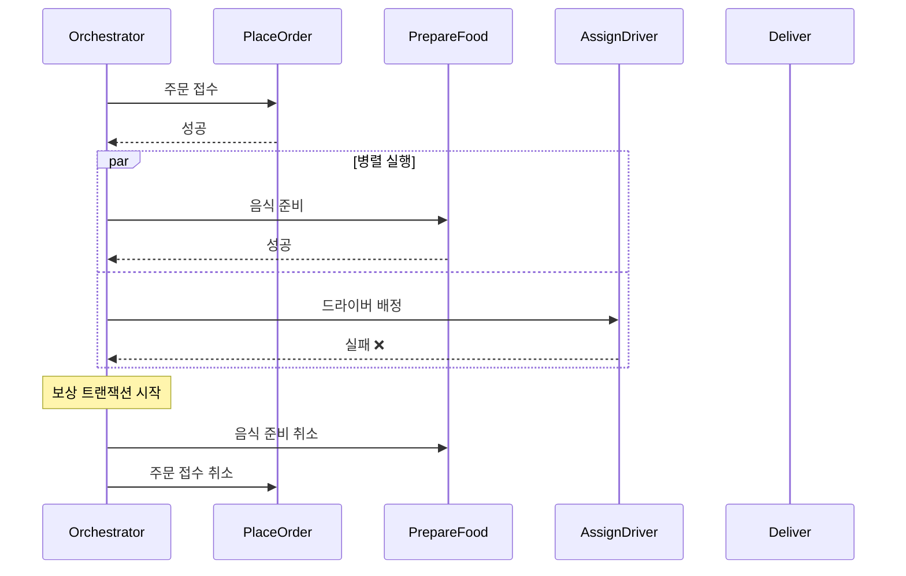

# Saga 패턴

분산 트랜잭션을 관리하기 위한 Saga 패턴의 다양한 구현 방식을 보여주는 학습용 프로젝트입니다.

Saga 패턴은 여러 서비스에 걸친 트랜잭션을 일련의 로컬 트랜잭션으로 분해하고, 실패 시 보상 트랜잭션을 실행하여 일관성을 유지합니다.

## 케이스

| # | 케이스 | Saga 유형 | 도메인 |
|---|--------|-----------|--------|
| 1 | Orchestration Saga | 중앙 오케스트레이터 조율 | 주문 처리 |
| 2 | Choreography Saga | 이벤트 기반 분산 조율 | 여행 예약 |
| 3 | Saga with Retry | 재시도 정책 + 보상 | 계좌 이체 |
| 4 | Parallel Saga | 병렬 스텝 실행 | 음식 배달 |

---

## Case 1: 주문 처리 (Orchestration)

중앙 오케스트레이터가 각 스텝을 순차적으로 실행하고, 실패 시 완료된 스텝들을 역순으로 보상합니다.



## Case 2: 여행 예약 (Choreography)

각 서비스가 이벤트를 발행하고 구독하여 독립적으로 동작합니다. 실패 시 보상 이벤트를 통해 롤백합니다.



## Case 3: 계좌 이체 (Retry)

일시적 실패에 대해 재시도 정책을 적용하고, 재시도 모두 실패 시 보상 트랜잭션을 실행합니다.



## Case 4: 음식 배달 (Parallel)

순차 스텝과 병렬 스텝을 혼합하여 실행합니다. 병렬 스텝 중 하나가 실패하면 나머지도 보상합니다.



## 핵심 구조

```
core/
├── SagaStep          - 스텝 인터페이스 (execute + compensate)
├── SagaResult        - 성공/실패 결과 sealed class
├── SagaOrchestrator  - 순차 실행 + 역순 보상
├── ParallelSagaOrchestrator - 병렬 그룹 실행
├── SagaEventBus      - 인메모리 이벤트 버스
└── RetryPolicy       - 재시도 정책
```

## 실행 방법

```bash
./gradlew test
```
