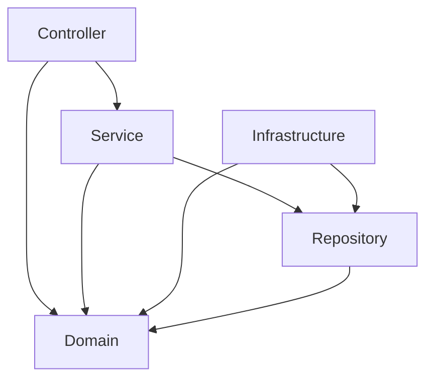
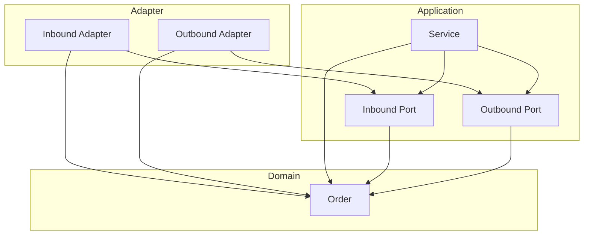

# ArchUnit

아키텍처 규칙을 코드로 작성하고 단위 테스트로 검증하는 [ArchUnit](https://www.archunit.org/) 라이브러리의 학습 프로젝트입니다.

동일한 주문 도메인을 **Layered Architecture**와 **Hexagonal Architecture** 두 가지 스타일로 구현하고, 각각에 대한 아키텍처 규칙을 ArchUnit으로 검증합니다.

## 케이스

| # | 아키텍처 | 핵심 API | 검증 포인트 |
|---|----------|----------|-------------|
| 1 | Layered Architecture | `layeredArchitecture()` | 레이어 간 의존 방향, 역방향 의존 금지, Domain 독립성 |
| 2 | Hexagonal Architecture | `onionArchitecture()` | Port/Adapter 분리, Domain 독립성, Adapter 간 격리 |

---

## Case 1: Layered Architecture

### 구조

```
layered/
├── controller/         → 요청을 받아 서비스에 위임
│   └── OrderController
├── service/            → 비즈니스 로직 처리
│   └── OrderService
├── repository/         → 데이터 접근 인터페이스
│   └── OrderRepository
├── domain/             → 도메인 모델 (외부 의존 없음)
│   ├── Order
│   └── OrderStatus
└── infrastructure/     → Repository 구현체
    └── InMemoryOrderRepository
```

### 의존성 방향



### 테스트

#### `layeredArchitecture()` DSL

전체 레이어 구조를 한 번에 선언적으로 정의합니다.

```kotlin
layeredArchitecture()
    .consideringAllDependencies()
    .layer("Controller").definedBy("..controller..")
    .layer("Service").definedBy("..service..")
    .layer("Repository").definedBy("..repository..")
    .layer("Domain").definedBy("..domain..")
    .layer("Infrastructure").definedBy("..infrastructure..")
    .whereLayer("Controller").mayNotBeAccessedByAnyLayer()
    .whereLayer("Service").mayOnlyBeAccessedByLayers("Controller")
    .whereLayer("Repository").mayOnlyBeAccessedByLayers("Service", "Infrastructure")
```

#### `noClasses()` - 개별 역방향 의존 금지

개별 규칙으로 더 명시적인 에러 메시지를 얻을 수 있습니다.

```kotlin
noClasses()
    .that().resideInAPackage("..service..")
    .should().dependOnClassesThat().resideInAPackage("..controller..")
```

#### Domain 독립성

```kotlin
classes()
    .that().resideInAPackage("..domain..")
    .should().onlyDependOnClassesThat()
    .resideInAnyPackage("..domain..", "java..", "kotlin..", "org.jetbrains..")
```

---

## Case 2: Hexagonal Architecture

### 구조

```
hexagonal/
├── domain/                     → 핵심 도메인 모델 (의존 없음)
│   ├── Order
│   └── OrderStatus
├── application/
│   ├── port/
│   │   ├── in/                 → Inbound Port (유스케이스 인터페이스)
│   │   │   └── CreateOrderUseCase
│   │   └── out/                → Outbound Port (영속성 인터페이스)
│   │       └── OrderPersistencePort
│   └── service/                → 유스케이스 구현
│       └── OrderCommandService
└── adapter/
    ├── in/                     → Inbound Adapter (외부 → 애플리케이션)
    │   └── OrderApiAdapter
    └── out/                    → Outbound Adapter (애플리케이션 → 외부)
        └── OrderMemoryAdapter
```

### 의존성 방향



### 테스트

#### `onionArchitecture()` DSL

ArchUnit의 Onion Architecture DSL로 Hexagonal 구조를 검증합니다.

```kotlin
onionArchitecture()
    .domainModels("..hexagonal.domain..")
    .applicationServices("..hexagonal.application..")
    .adapter("in", "..hexagonal.adapter.in..")
    .adapter("out", "..hexagonal.adapter.out..")
    .withOptionalLayers(true)
```

#### Adapter 격리

Inbound/Outbound Adapter는 각자의 Port만 참조하고, 서로 의존하지 않아야 합니다.

```kotlin
// Inbound Adapter → Inbound Port만 접근
noClasses()
    .that().resideInAPackage("..adapter.in..")
    .should().dependOnClassesThat()
    .resideInAnyPackage("..application.service..", "..application.port.out..")

// Adapter 간 격리
noClasses()
    .that().resideInAPackage("..adapter.in..")
    .should().dependOnClassesThat()
    .resideInAPackage("..adapter.out..")
```

#### Port 인터페이스 독립성

Port는 Domain에만 의존하여 외부 기술 의존을 차단합니다.

```kotlin
classes()
    .that().resideInAPackage("..application.port.in..")
    .should().onlyDependOnClassesThat()
    .resideInAnyPackage("..application.port.in..", "..domain..", "java..", "kotlin..", "org.jetbrains..")
```

---

## 핵심 개념

### ArchUnit 동작 방식

```
[Kotlin 소스] → [컴파일] → [바이트코드(.class)] → [ArchUnit이 분석] → [규칙 검증]
```

바이트코드를 분석하므로 Java뿐만 아니라 Kotlin, Scala 등 모든 JVM 언어에서 사용할 수 있습니다.

### 주요 API

| API | 용도 |
|-----|------|
| `layeredArchitecture()` | 레이어 아키텍처 전체 구조 검증 |
| `onionArchitecture()` | 헥사고날/어니언 아키텍처 전체 구조 검증 |
| `classes()` | 클래스 대상 규칙 (`classes().that()...should()...`) |
| `noClasses()` | 금지 규칙 (`noClasses().should().dependOn...`) |

### `layeredArchitecture()` vs `noClasses()`

| 방식 | 장점 | 단점 |
|------|------|------|
| `layeredArchitecture()` | 전체 구조를 한 번에 선언 | 어떤 규칙이 위반되었는지 파악이 어려움 |
| `noClasses()` | 개별 규칙별 명확한 에러 메시지 | 규칙을 하나씩 작성해야 함 |

두 방식을 함께 사용하면 전체 구조 검증 + 개별 규칙 디버깅이 가능합니다.

## 실행 방법

```bash
./gradlew test
```
